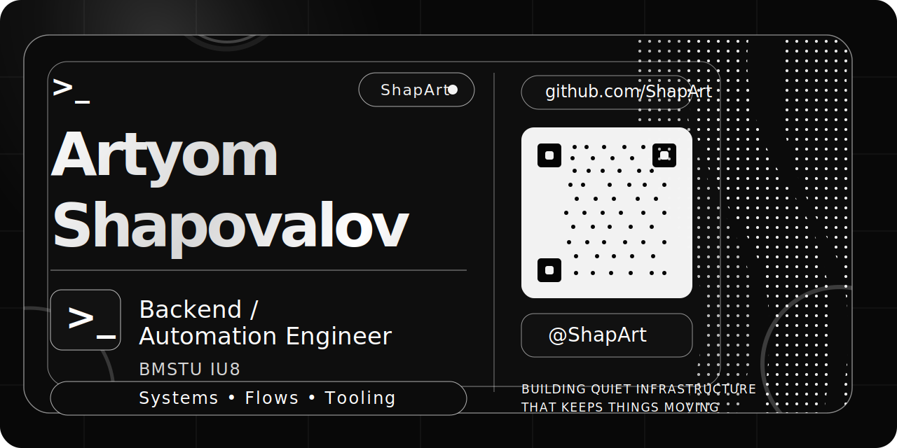

<h1 align="center">ShapArt</h1>

<strong>Backend, automation, and operator tooling</strong>

I build practical software for workflows that are usually painful, repetitive, or easy to break: Telegram bots, internal operator tools, browser automation, data export utilities, and systems that sit between infrastructure and day-to-day operations.

A meaningful part of my applied work lives in private repositories because it is tied to internal environments, coursework materials, or non-public assets. The repositories here show the kind of engineering problems I like to work on: delivery flows, operator UX, guarded automation, and tools that reduce manual effort.

## Focus areas

- **Backend systems** for API-driven flows, integrations, and operational logic
- **Automation and workflow tooling** for repetitive business processes and internal support scenarios
- **Telegram bots and operator UX** where onboarding, delivery, and support have to work together
- **Browser-side operator tools** for improving workflows inside existing systems
- **Infrastructure-minded delivery** with attention to configuration, failure modes, and maintainability
- **Academic foundations** across networks, databases, embedded systems, electronics, and applied ML coursework

## Selected projects

- `vpn-bot-stars-hiddify` — Telegram-first VPN subscription backend with payment, provisioning, deeplink and reminder flow
- `Matrtix-Cleaner` — Tampermonkey operator tool for guarded bulk changes in OpenText approval matrices
- `opentext-operator-bridge` — private guarded intake, triage, and operator workflow backend for OpenText-related support scenarios
- `outlook-exporter` — Windows-first Outlook export and spreadsheet processing workspace
- `tampermonkey-ozon-tickets-export` — browser helper for ticket export and operator-side review
- `eyegate-l-luckfox-scud` — edge-focused computer vision prototype for constrained hardware

## Supporting work

- Telegram bots: `kino-bot`, `qotd-telegram-bot`, `tg-media-downloader-bot`, `bmstu-practice-2024-telegram-bot`
- Media utilities: `compress-photos-cli`, `image-cover-cropper`, `media-compressor-web`
- Academic foundations: `8-sem-network-labs`, `ASVT`, `labs`, `kursovaia-coursework`, `db-music-store`, `dsp-labs`, `tsosi-course-projects`
- Context and prototypes: `cases-and-achievements`, `selfhost-cloud`, `private-messenger`, `Jornal`

## Engineering approach

I like systems that turn fragile manual steps into repeatable workflows.

That usually means being careful about boundaries: what should be automated, what should stay operator-controlled, what needs a preview first, and what has to fail closed instead of failing creatively.

I care more about clear behavior and usable interfaces than about over-abstracting a codebase for its own sake.

## Stack snapshot

**Languages and runtime**

Python, JavaScript, SQL, shell tooling

**Typical building blocks**

FastAPI, Telegram Bot API, SQLite, SQLAlchemy, pandas, openpyxl, PySide6, Playwright, browser userscripts, environment-driven configuration

## RU

Делаю прикладные backend- и automation-инструменты: боты, операторские утилиты, экспортёры, браузерную автоматизацию и сервисы на стыке инфраструктуры и повседневных процессов.

Для меня важны не громкие слова, а понятная инженерная ценность: меньше рутины, меньше хрупких ручных действий, больше предсказуемости в работе системы.
