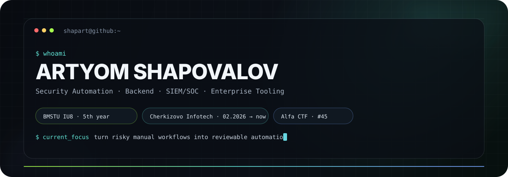

<div align="center">



<br>

[](PORTFOLIO.md)
[](RESUME.md)
[](CERTIFICATES.md)
[](https://t.me/shapart)

</div>

## `01 / profile`

I am **Artyom Shapovalov**, a 5th-year Computer Security student at **BMSTU IU8** and a document-workflow automation specialist at **Cherkizovo Infotech**.

I work where security, backend engineering and inconvenient enterprise systems overlap: **OpenText/TESSA approval routes, browser automation, SIEM/log pipelines, Windows/Linux operations, data tooling and small backend services**.

The kind of task I enjoy most is simple to describe: take a system nobody wants to touch, understand what can break, find the repetitive part, and turn it into something people can safely use every day.

> **Looking for:** junior / internship roles in **SIEM/SOC engineering, security automation, AppSec or security-minded backend development**.

### At a glance

| | |
|---|---|
| 🎓 **Education** | BMSTU IU8 · 10.05.01 Computer Security · 5th year |
| 🏢 **Current work** | Cherkizovo Infotech · OpenText/TESSA · since February 2026 |
| ⚙️ **Core** | Python · JavaScript · SQL · Linux · Git · Docker · PostgreSQL |
| 🛡️ **Security** | MaxPatrol SIEM · Windows Event Logs · Sysmon · NetFlow · log parsing · AppSec |
| 🚩 **CTF** | **45th place — Alfa CTF 2026** |
| 🎯 **Engineering bias** | preview → review → bounded apply → verify |

---

## `02 / flagship_projects`

### 🥇 [OpenText Toolkit / Matrix Cleaner](https://github.com/ShapArt/Matrtix-Cleaner)

**The project that represents me best.** A Tampermonkey operator toolkit for real OpenText approval matrices, tickets and change requests.

It grew from a small helper into a safety-oriented automation layer: it understands request scope, inspects matrix context, builds a concrete change plan, shows exactly which rows will be touched, blocks ambiguity and applies only the approved operations.

**Impact at work:** bulk changes that previously meant hours of repetitive row-by-row editing can now be prepared and completed in roughly **10 minutes** for typical covered scenarios. The tool is used in daily OpenText work by me and a senior specialist.

`request → parse → scope → preview → review → guarded apply → verify`

**Built with:** `JavaScript` · `Tampermonkey` · `Playwright` · browser/DOM automation · corpus-driven regression testing

---

### 🥈 [TESSA Matrix Studio](https://github.com/ShapArt/tessa-matrix-studio)

**Excel round-trip editor for TESSA approval matrices.** Export structured matrix data, edit it in XLSX, generate an exact diff and apply only reviewed changes.

<div align="center">
  <a href="https://github.com/ShapArt/tessa-matrix-studio">
    
  </a>
</div>

`TESSA → XLSX → edit → diff → review → safe apply`

The interesting part is preserving identity and live-state checks so that “Excel editing” does not become blind bulk mutation.

---

### 🥉 [EyeGate-L](https://github.com/ShapArt/eyegate-l-luckfox-scud)

Edge computer-vision access-control prototype for LuckFox-class hardware: local inference, GPIO interaction and a design that keeps the decision layer separate from the physical lock action.

**Built with:** `Python` · `OpenCV` · edge/CV concepts · local-first processing

---

### 🔐 [SH4PART VPN](https://github.com/ShapArt/vpn-bot-stars-hiddify)

Telegram-first subscription backend connecting payment/user state with provisioning and profile delivery.

**Built with:** `Python` · `FastAPI` · `SQLite` · `Hiddify/Xray` · `nginx` · `systemd`

---

### 📬 [SLA / Outlook Toolkit](https://github.com/ShapArt/outlook-exporter)

Windows/Office automation for mailbox-driven operations: Outlook/Graph extraction, SQLite/Excel data flow, status tracking and deadline reporting.

This project comes from my previous systems-administration work, where recurring Outlook/Excel operations were turned into reusable tools instead of permanent copy-paste routines.

**Built with:** `Python` · `pywin32` · `Microsoft Graph` · `SQLite` · `pandas` · `openpyxl`

> More shipped work and quantified cases: **[cases-and-achievements](https://github.com/ShapArt/cases-and-achievements)**

---

## `03 / experience`

### Cherkizovo Group · Document Workflow Automation
**Specialist · February 2026 — present**

- support **OpenText/TESSA** and document approval processes;
- configure approval matrices and routes: approvers, signers, legal entities, categories, document types, limits and stage conditions;
- investigate user incidents, routing errors and non-standard document cases;
- compare cards and approval sheets, prepare reports and validate data;
- write internal utilities and exports with **JavaScript, Python and SQL**;
- designed and introduced **OpenText Toolkit / Matrix Cleaner** for controlled bulk changes;
- typical covered bulk operations went from **hours of repetitive UI work to ~10 minutes**.

### NAOS Vostok · Systems Administrator
**November 2022 — February 2026**

- issued and configured PCs, peripherals, accounts and workplace access;
- worked with **Windows, Microsoft 365, Intune, device policies, remote access and Windows Server tasks**;
- supported Bitrix / 1C operational workflows and published `naos.ru` pages from prepared layouts;
- automated repetitive browser and Windows workflows with scripts;
- built reporting flows around **Power Automate, Excel and Power BI**;
- developed an **SLA tracker** where Outlook/Graph data was stored in SQLite, exported to Excel and used for automated deadline reminders.

---

## `04 / security_practice`

I am studying security formally, but I prefer the practical side of it:

- **MaxPatrol SIEM** — event delivery, source diagnostics, parsing and event investigation;
- **Windows telemetry** — Event Logs, authentication/RDP events, Sysmon concepts;
- **network data** — NetFlow and traffic/log-analysis exercises;
- **Linux** — daily CLI work, services, permissions, networking and logs;
- **AppSec** — authentication/authorization, secrets, safe defaults, failure modes and OWASP-oriented thinking;
- **automation safety** — dry-run/preview, explicit scope, auditability and refusing to guess on destructive changes;
- **CTF** — web, crypto, reverse and general security problem solving.

### Alfa CTF 2026

**45th place** in the official standings as team **«Альпийские тетерева»**.  
[Standings](https://clist.by/standings/alfa-ctf-2026-66930397/) · [Alfa CTF](https://alfactf.ru/)

---

## `05 / stack`

**Programming**  
`Python` `JavaScript` `SQL` `C++` `Shell` `HTML/CSS`

**Backend & data**  
`FastAPI` `REST API` `PostgreSQL` `SQLite` `pandas` `openpyxl`

**Infra & systems**  
`Linux` `Docker` `nginx` `systemd` `Git` `Windows` `Microsoft 365` `Intune`

**Security & telemetry**  
`MaxPatrol SIEM` `Windows Event Logs` `NetFlow` `log parsing` `AAA` `RDP` `iptables` `OSINT`

**Automation & CV**  
`Tampermonkey` `Playwright` `pywin32` `Power Automate` `OpenCV`

---

## `06 / education_and_certificates`

🎓 **BMSTU IU8** — Computer Security (10.05.01), 5th year  
🌐 **BMSTU Digital Department** — Web Developer, 2024  
🛡️ **VK Education** — Application Security / AppSec, 2025

### 2026

- [DevOps простым языком](https://stepik.org/cert/3328074)
- [Доверенный искусственный интеллект](https://stepik.org/cert/3328089)
- [Специалист по противодействию кибератакам](https://stepik.org/cert/3328110)
- **Alfa CTF — 45th place**

### 2025

- [Введение в SQL](https://stepik.org/cert/2937373)
- [Введение в информационную безопасность аппаратных решений](https://stepik.org/cert/2945060)
- [Теория вероятностей](https://stepik.org/cert/2945135)

### Earlier

- **Skolkovo / Arctic Probe 2020** — engineering-project winner, Arctic buoy prototype

→ **[Full certificate list](CERTIFICATES.md)**

---

## `07 / how_i_build`

```text
understand the system
        ↓
find the dangerous assumptions
        ↓
model the scope
        ↓
preview the exact change
        ↓
review / test
        ↓
apply the bounded operation
        ↓
verify the real result
```

I use ChatGPT, Codex, Cursor and Claude heavily, but the useful part is the workflow around them: **plan, diff, tests, review and verification**. “AI generated it” is not a validation strategy.

---

## `08 / activity`

<div align="center">
  <picture>
    <source media="(prefers-color-scheme: dark)" srcset="https://raw.githubusercontent.com/ShapArt/ShapArt/output/github-contribution-grid-snake-dark.svg">
    <source media="(prefers-color-scheme: light)" srcset="https://raw.githubusercontent.com/ShapArt/ShapArt/output/github-contribution-grid-snake.svg">
    
  </picture>
</div>

The contribution animation is generated by **GitHub Actions** and stored in this repository — no manually updated screenshot.

---

<details>
<summary><strong>🇷🇺 Коротко по-русски</strong></summary>
<br>

Я Артём Шаповалов, студент 5 курса ИУ8 МГТУ им. Н. Э. Баумана по специальности «Компьютерная безопасность».

С февраля 2026 работаю в Черкизово с OpenText/TESSA: сопровождаю согласование документов, настраиваю матрицы и маршруты, разбираю сложные заявки и пишу внутренние инструменты. Разработал OpenText Toolkit / Matrix Cleaner — инструмент для контролируемых массовых изменений, который сократил типовые операции с часов ручной работы примерно до 10 минут.

До этого больше трёх лет работал системным администратором: Windows, Microsoft 365, Intune, серверные задачи, автоматизация Outlook/Excel, Power Automate и SLA-трекинг.

Сейчас развиваюсь в SIEM/SOC, security automation и AppSec. Есть практический опыт с MaxPatrol SIEM, журналами Windows/Linux, NetFlow и диагностикой источников. Основные языки — Python, JavaScript и SQL.

</details>

<div align="center">

### `contact`

[Telegram](https://t.me/shapart) · [Email](mailto:artem.shapovalov2003@gmail.com) · [Resume](RESUME.md) · [Portfolio](PORTFOLIO.md)

</div>
