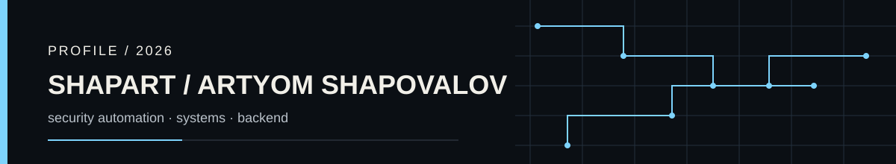
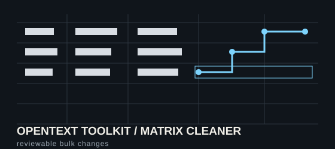
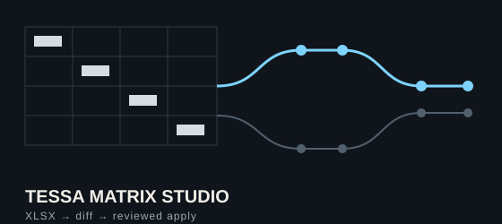
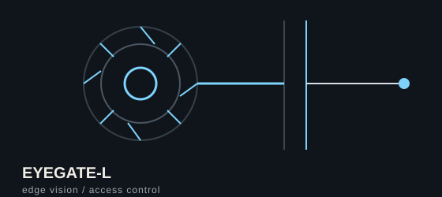
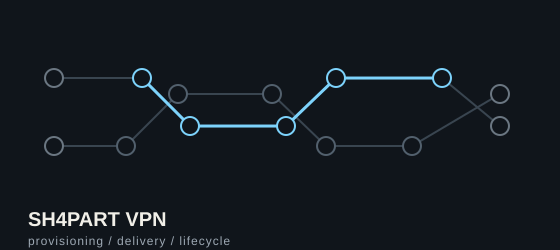
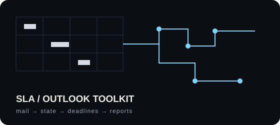

  

# Artyom Shapovalov

**Security automation · SIEM/SOC · backend · internal tools**

Most of my work starts with something people already do by hand: a route that is hard to debug, a spreadsheet that is easy to break, or an operational task nobody wants to repeat. I try to turn that into a tool that **shows its plan, changes only what it was asked to change, and leaves enough evidence to check the result**.

I am a 5th-year Computer Security student at **BMSTU IU8** and work with **OpenText/TESSA at Cherkizovo**. My main languages are Python, JavaScript and SQL; day to day I also work with Linux, Windows, databases, REST APIs, logs and automation around existing systems.

Looking for junior / internship roles in **SIEM/SOC, security automation or AppSec**.

[Portfolio](PORTFOLIO.md) · [Case Notes](https://github.com/ShapArt/cases-and-achievements) · [Resume](RESUME.md) · [Certificates](CERTIFICATES.md) · [HH / RU profile](HH_RU_PROFILE.txt) · [Telegram](https://t.me/shapart) · [Email](mailto:artem.shapovalov2003@gmail.com)

**OpenText bulk work: hours → ~10 min** · **Alfa CTF 2026: #45** · **3+ years in systems / automation before my current role**

---

## Selected work

<table width="100%">
<tr>
<td width="58%" valign="top">

</td>
<td width="42%" valign="top">
<h3><a href="https://github.com/ShapArt/Matrtix-Cleaner">OpenText Toolkit / Matrix Cleaner</a></h3>

Started as a small Tampermonkey helper for approval matrices. It now parses requests, scopes changes, previews affected rows, blocks ambiguous cases and applies only reviewed operations.

On covered bulk changes, work that used to take hours can be completed in roughly <strong>10 minutes</strong>.

<code>JavaScript · Tampermonkey · Playwright</code>

</td>
</tr>
</table>

### More selected work

<table>
<tr>
<td width="50%" valign="top">

<h3><a href="https://github.com/ShapArt/tessa-matrix-studio">TESSA Matrix Studio</a></h3>

Round-trip editor for approval matrices: export to XLSX, make bulk edits, get an exact diff, review it, then apply only if the live state still matches.

<code>JavaScript · XLSX · CI / releases</code>

</td>
<td width="50%" valign="top">

<h3><a href="https://github.com/ShapArt/eyegate-l-luckfox-scud">EyeGate-L</a></h3>

Two-door access-control prototype with a camera/vision pipeline, access policy, gate state machine, authentication, React UI and hardware-facing layer for LuckFox-class edge hardware.

<code>Python · FastAPI · OpenCV · React · serial / hardware</code>

</td>
</tr>
<tr>
<td width="50%" valign="top">

<h3><a href="https://github.com/ShapArt/vpn-bot-stars-hiddify">SH4PART VPN</a></h3>

Small self-hosted backend connecting Telegram Stars payment state to SQLite, Hiddify provisioning, subscription delivery and expiry reminders.

<code>Python · FastAPI · SQLite · Telegram Stars · Hiddify</code>

</td>
<td width="50%" valign="top">

<h3><a href="https://github.com/ShapArt/outlook-exporter">SLA / Outlook Toolkit</a></h3>

Windows-first support tooling: Classic Outlook / MAPI → SQLite ticket state → SLA calculation → Excel reports and deadline reminders.

<code>Python · pywin32 · SQLite · pandas · PySide6</code>

</td>
</tr>
</table>

Deeper project context: [Case Notes](https://github.com/ShapArt/cases-and-achievements)

---

## Recent releases

<!-- RECENTLY-SHIPPED:START -->
- [Matrix Cleaner](https://github.com/ShapArt/Matrtix-Cleaner/releases/tag/v12.4.0) · `v12.4.0` · 2026-09-02
- [TESSA Matrix Studio](https://github.com/ShapArt/tessa-matrix-studio/releases/tag/v1.9.51) · `v1.9.51` · 2026-09-02
- [SH4PART VPN](https://github.com/ShapArt/vpn-bot-stars-hiddify/commit/db2f1ff35f5b68772cf2bc17e863bfa0ea3e10e5) · `db2f1ff` · 2026-09-03
- [EyeGate-L](https://github.com/ShapArt/eyegate-l-luckfox-scud/commit/46f7278f5720d90b35a4b632676a30b6c02dfd17) · `46f7278` · 2026-09-03
<!-- RECENTLY-SHIPPED:END -->

Updated automatically from the public repositories above.

---

## Work

### Cherkizovo Group — document workflow automation
**February 2026 — present**

OpenText/TESSA approval routes, matrices, signers, legal entities, categories, document types, sites and limits. A lot of the job is figuring out **why a route behaved the way it did** and whether the recurring part can be automated without making the process harder to inspect.

Matrix Cleaner and TESSA Matrix Studio both came directly from that work.

### NAOS Vostok — systems administrator
**November 2022 — February 2026**

More than three years around Windows workplaces, Microsoft 365, Intune, device policies, access, Windows Server and user support. I wrote scripts and browser helpers, automated Outlook / Excel routines, built Power Automate / Power BI reporting flows and an SLA tracker around `Outlook → SQLite → Excel → reminders`.

---

## Security / systems

**SIEM & telemetry** — MaxPatrol SIEM, Windows Event Logs, authentication / RDP events, Sysmon concepts, NetFlow, log parsing, source diagnostics, Linux logs, auditd / syslog-style pipelines.

**Programming & backend** — Python, JavaScript, SQL, FastAPI, REST APIs, PostgreSQL, SQLite, pandas, openpyxl.

**Systems & automation** — Linux, Windows, Docker, nginx, systemd, Git, Microsoft 365, Intune, Tampermonkey, Playwright, pywin32, Power Automate.

**Security habits** — authentication / authorization, secret handling, explicit scope, preview / dry-run, auditability, safe failure modes and post-action verification.

---

## Education / evidence

**BMSTU IU8** — 10.05.01 Computer Security · 5th year  
**VK Education** — Application Security / AppSec · 2025  
**BMSTU Digital Department** — Web Developer · 2024  
**Alfa CTF 2026** — 45th place

<strong>Selected certificates</strong>

 

- [DevOps простым языком](https://stepik.org/cert/3328074)
- [Доверенный искусственный интеллект](https://stepik.org/cert/3328089)
- [Специалист по противодействию кибератакам](https://stepik.org/cert/3328110)
- [Введение в SQL](https://stepik.org/cert/2937373)
- [Введение в информационную безопасность аппаратных решений](https://stepik.org/cert/2945060)
- [Теория вероятностей](https://stepik.org/cert/2945135)

Full list: [CERTIFICATES.md](CERTIFICATES.md)

---

## Activity

  <picture>
    <source media="(prefers-color-scheme: dark)" srcset="https://raw.githubusercontent.com/ShapArt/ShapArt/output/github-contribution-grid-snake-dark.svg">
    <source media="(prefers-color-scheme: light)" srcset="https://raw.githubusercontent.com/ShapArt/ShapArt/output/github-contribution-grid-snake.svg">
    
  </picture>

<strong>По-русски</strong>

 

Я Артём Шаповалов, студент 5 курса ИУ8 МГТУ им. Н. Э. Баумана по специальности «Компьютерная безопасность».

С февраля 2026 работаю в Черкизово с OpenText/TESSA: сопровождаю процессы согласования документов, разбираю матрицы и маршруты, пользовательские заявки и нетиповые случаи. Параллельно пишу внутренние инструменты на JavaScript, Python и SQL. OpenText Toolkit / Matrix Cleaner сократил типовые массовые операции с часов ручной работы примерно до 10 минут.

До этого больше трёх лет работал системным администратором с Windows, Microsoft 365, Intune, Windows Server и автоматизацией Outlook / Excel-процессов.

Сейчас двигаюсь в сторону SIEM/SOC, security automation и AppSec. Есть практический опыт с MaxPatrol SIEM, журналами Windows/Linux, NetFlow и диагностикой источников.

